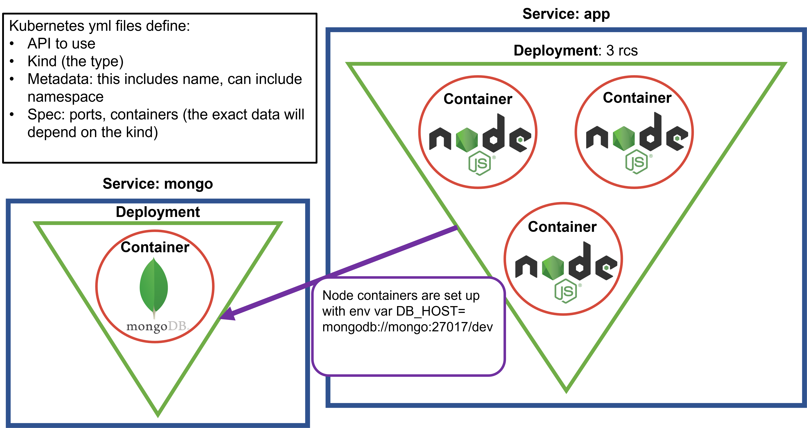

# Docker and Kubernetes
Repository for learning Docker and Kubernetes.

## Microservices Architecture
- Made up, somewhat unsuprisingly, from microservices.
- These are distinct specialised units of services or servers that communicate via APIs, and together form the entire application.
- This allows different parts of the network to be tested/debugged/changed without affecting the application until they are ready for deployment.
- E.g., an online shop such as Amazon has a login page, different item categories, a basket, payment page, and databases to store information, which are all microservices.
- A local online shop would have a monolithic architecture - that is, all parts of the application would exist on one server.
- Advantage of microservices architecture - ensures constant deployment for customers whilst the application is updated and maintained.
- Disadvantage: higher maintainance costs.
## Containerisation (with Docker)

- Containerisation is the packaging of code and dependencies into an isolated, light-weight container, which can then be run on (ideally) ANY local machine.
- A container doesn't contain anything more than an app and its running environment - whereas a virtual machine has an OS, CPU, etc. and is therefore much larger. 
- In particular, containerisation is more useful for microservice architectures, whereas VMs are more useful for monolithic architectures.
- Docker is a containerisation tool that works wiht Windows, Mac and Linux machines.
- Docker container lifecycle: build, run, stop, start, (and so on) until destroy.
- Docker uses a REST API to pull images from docker with which to build containers - these are immutable instructions on how to build a container with specific dependencies and code.
- Docker daemon listens for Docker API requests and manages Docker objects.
- Advantages of Docker: open-source (with a variety of images available), easy interface, automated container creation.

## Basic Docker commands
- If on Windows, run `alias docker="wintpy docker"` to ensure that docker commands will work.
- To pull an image from Docker Hub, use `docker pull image_name`.
- To run a container using the image (either from local machine or Docker Hub) use `docker run -d -p 80:80 image_name` (where port 80 is the
port the application runs on.)
- To enter into a container, use `docker exec -it container_number bash`
- You can navigate as per normal.

## Building a customised Docker image
- This process describes the creation of an image for running the Sparta Global test app, and then making it globally available.
- Create a folder which stores the code for the node app, and then navigate to the `app` folder within it.
- Create a `Dockerfile` - no extension.
- Within the Docker file:
  - `FROM node`
  - `WORKDIR /usr/src/app`
  - `COPY package*.json ./`
  - `RUN npm install -g npm@latest`
  - `RUN npm install express`
  - `COPY . .`
  - `EXPOSE 3000`
  - `CMD ["node", "app.js"]`
- In the app folder, run `docker build -t docker_hub_username/image_name:v#`, where `#` is some number; without this, the tag will default to latest.
- If successful, run `docker run -d -p 80:3000 docker_hub_username/image_name:v#` (make sure port 80 is not already engaged).
- Enter localhost in your browser, and the app homepage should be displayed.

## Building custom production-ready docker image
- Add `as app` after `FROM node` in the above.
- Then add the following:
  - `# ###`
  - `# Let's build multi-stage production ready code`
  - `FROM node:alpine`
  - `WORKDIR /usr/src/app`
  - `COPY package*.json ./`
  - `RUN npm install -g npm@latest`
  - `RUN npm install express`
  - `# This line of code compresses the image`
  - `COPY --from=app /usr/src/app /usr/src/app`
  - `EXPOSE 3000`
  - `CMD ["node", "app.js"]`
- Then build using this dockerfile, and an image approx 25% the size should be created.

## Kubernetes (K8)

- To install K8:
  - Open Docker console on computer
  - In Settings, select Kubernetes
  - Tick `Enable Kubernetes` - leave `Show system containers` unticked.
  - Apply the changes.
  - When the K8 symbol is green at the bottom left, it has finished installing.
- To test installation, the command `kubectl` in the bash terminal should show a list of commands that can be utilised.
- `kubectl get service` should show that a ClusterIP `kubernetes` is running

### K8 terminology/concepts
- Pods are the smallest possible unit of computing you can deploy in Kubernetes. These are a groups of containers with shared storage 
space, network resources and a specification on how to run the containers.
- A volume is a directory, possible with some data in it, that is accessible to all containers in a pod.

### Using K8 with node app

- Create node-app-deploy.yml:
```
apiVersion: apps/v1

kind: Deployment

metadata:
  name: node_app
spec:
  selector:
    matchLabels:
      app: node_app
  replicas: 3 # Creates and maintains 3 containers to distribute load.
  template:
    metadata:
      labels:
        app: node_app
    spec:
      containers:
        - name: node_app
          image: njha42/eng110_node_app_prod

          ports:
            - containerPort: 3000

          imagePullPolicy: Always
```
- create svc-node-app.yml
```
apiVersion: v1
kind: Service
metadata:
  name: node_app
  namespace: default
spec:
  ports:
  - nodePort: 30442 # 30000 - 302222
    port: 3000
    protocol: TCP
    targetPort: 3000
  selector:
    app: node_app
  type: NodePort
```
- Run `kubectl create -f node-app-deploy.yml`
- Run `kubectl create -f svc-node-app.yml`
- Run `kubectl get svc` - this will show the port the app service is running on.
- Checkout the port on your localhost - you should be able to see the app homepage and /fibonacci/`some_number`
### Adding the mongo db

- Add env parameters under spec -> containers:
```
spec:
  containers:
    - name: node-app
      image: njha42/eng110_node_app_prod
      env: # Updating file to include DB_HOST env var
        - name: DB_HOST
          value: mongodb://mongo:27017/dev
      ports:
        - containerPort: 3000

      imagePullPolicy: Always
```
- You will also need to create this mongo.yml file; note that this is essentially three .yml files
in one:
```
apiVersion: v1
kind: PersistentVolumeClaim
metadata:
  name: mongo-pvc
spec:
  accessModes:
    - ReadWriteOnce
  resources:
    requests:
      storage: 256Mi
---
apiVersion: v1
kind: Service
metadata:
  name: mongo
spec:
  selector:
    app: mongo
  ports:
    - port: 27017
      targetPort: 27017
---
apiVersion: apps/v1
kind: Deployment
metadata:
  name: mongo
spec:
  selector:
    matchLabels:
      app: mongo
  template:
    metadata:
      labels:
        app: mongo
    spec:
      containers:
        - name: mongo
          image: mongo:3.6.17-xenial
          ports:
            - containerPort: 27017
          volumeMounts:
            - name: storage
              mountPath: /data/db
      volumes:
        - name: storage
          persistentVolumeClaim:
            claimName: mongo-pvc
 ```
 - After you run these new files, you should be able to access the posts page of the app.